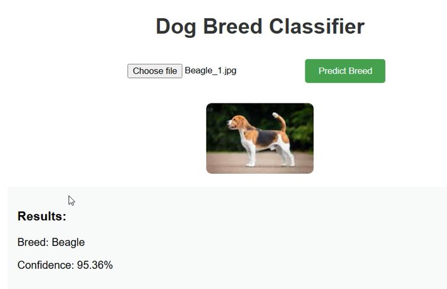

# Session11 - Gradio Lambda Deployment with AWS CDK

This project demonstrates deploying a Gradio-based Docker application on AWS Lambda using AWS CDK (Cloud Development Kit). The Lambda function is built using a Docker image defined in a Dockerfile, and it exposes a public HTTP URL for invoking the Gradio application.

## Features
- AWS Lambda with Docker: Deploys a Lambda function using a Docker image.
- Gradio Integration: Runs a Gradio application within the Lambda environment.
- Function URL: Provides a public URL to access the Lambda function.
- AWS CDK Deployment: Uses AWS CDK for Infrastructure as Code (IaC) deployment.

## Prerequisites
- AWS Account: Ensure you have an active AWS account.
- AWS CLI: Configure your AWS CLI with appropriate credentials.
- AWS CDK: Install AWS CDK on your local machine.
- Docker: Install Docker to build and manage the Docker image locally.
- Python Environment: Ensure Python is installed along with required dependencies (aws-cdk-lib and constructs).

## Project Structure

```
.
├── app.py               # AWS CDK stack definition
├── Dockerfile           # Dockerfile for building the Lambda image
├── README.md            # Project documentation
└── cdk.json             # CDK configuration file
├── mambaout.onnx        # Model Image
├── aws-reqs.txt         # requirements for AWS
└── main.py              # FastAPI application
```

## Setup and Deployment

#### Step 1: Install Dependencies

```
python -m venv .venv
source .venv/bin/activate
pip install -r aws-reqs.txt 

curl "https://awscli.amazonaws.com/awscli-exe-linux-x86_64.zip" -o "awscliv2.zip"
unzip awscliv2.zip
sudo ./aws/install

npm install
```

#### Step 2: Define Environment Variables
Ensure your environment has the following variables set:

CDK_DEFAULT_ACCOUNT: Your AWS account ID.
CDK_DEFAULT_REGION: Your AWS region (default: ap-south-1).
You can set these variables in your shell or provide them explicitly in the code.

#### Step 3: Build, Synthesize CloudFormation and Deploy the CDK Stack


```
aws configure list
aws configure
aws configure list
cdk --version

```

##### Install AWS CDK globally

```
npm install -g aws-cdk

```

##### Synthesize the CloudFormation template

```
cdk synth 
cdk bootstrap

```

##### Deploy the stack

```
cdk deploy --verbose --progress bar 
```


#### Step 4: Access the Function

After deployment, the public Function URL will be displayed as part of the CloudFormation output. Use this URL to interact with your Gradio application.


##### Test Images




##### Destroy the stack:

```
cdk destroy
```


## Notes

- **Docker Image**: Ensure the Dockerfile in the project root defines the Gradio application correctly.
- **Memory and Timeout**: Adjust the memory size and timeout in the DockerImageFunction definition based on your application's requirements.
- **Authentication**: The Function URL is public (auth type: NONE). Update the auth_type for more secure access.